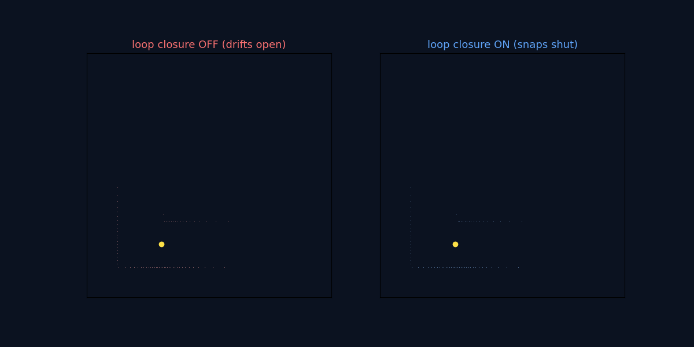

# lidar_slam_2d_cuda


*Left: scan-to-scan dead reckoning drifts. Right: the scan-level BA core stays consistent.*



*Loop closure: open-loop odometry drifts and the walls smear (left); recognising the start adds a pose-graph constraint that snaps the map shut (right).*

2D LiDAR SLAM with a fixed-lag, **scan-level bundle-adjustment** core (CUDA-bound). ROS-free, CLI-first.

## Quick start

```bash
pip install -e .

# JSONL demo
slamx replay examples/fixture_scans.jsonl --config configs/scan_ba_backpack_s300.yaml --out runs/demo

# ROS bag (LaserScan topic)
pip install -e .[rosbag]
slamx replay <bag> --topic <scan_topic> --config configs/scan_ba_backpack_s300.yaml --out runs/demo
```

## How it works

Each scan is aligned against a TSDF rebuilt from a sliding window of recent scans (scan-to-local-map), then a fixed-lag window of poses is jointly optimized (Gauss-Newton / LM) with motion and anchor priors. Revisited places are detected against past nodes, verified by TSDF alignment, and closed with a global pose-graph solve. Code: `src/slamx/core/scan_ba/`. Design and roadmap: `notes/design_cuda_scan_ba.md`.

## Status

CPU reference (fixed-lag scan-BA + loop closure) is landing (P0–P1.5). Next: CUDA port of the inner solve.
