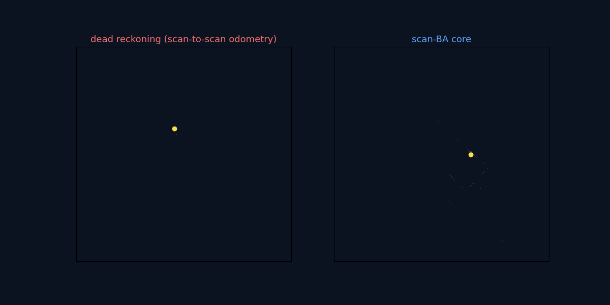
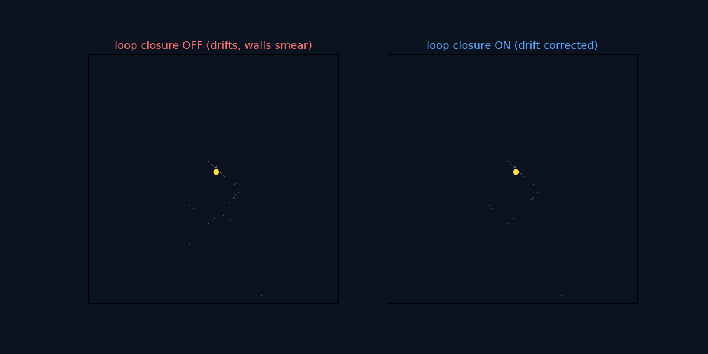

# lidar_slam_2d_cuda



*Left: scan-to-scan dead reckoning drifts. Right: the scan-level BA core stays consistent.*



*Loop closure on Google Cartographer `backpack_2d` (500 scans, 279 loop edges): without it the walls smear as drift accumulates (left); with it, each revisit (green edges) adds a pose-graph constraint that pulls the drift back and keeps the walls crisp (right).*

2D LiDAR SLAM with a fixed-lag, **scan-level bundle-adjustment** core (CUDA-bound). ROS-free, CLI-first.

## Quick start

```bash
pip install -e .

# JSONL demo
slamx replay examples/fixture_scans.jsonl --config configs/scan_ba_backpack_s300.yaml --out runs/demo

# ROS bag (LaserScan topic)
pip install -e .[rosbag]
slamx replay <bag> --topic <scan_topic> --config configs/scan_ba_backpack_s300.yaml --out runs/demo
```

## How it works

Each scan is aligned against a TSDF rebuilt from a sliding window of recent scans (scan-to-local-map), then a fixed-lag window of poses is jointly optimized (Gauss-Newton / LM) with motion and anchor priors. Revisited places are detected against past nodes, verified by TSDF alignment, and closed with a global pose-graph solve. Code: `src/slamx/core/scan_ba/`. Design and roadmap: `notes/design_cuda_scan_ba.md`.

## GPU acceleration

Set `slam.scan_ba.use_cuda: true` (needs `pip install -e .[cuda]`) to run the per-scan TSDF fold and the fixed-lag window solve on the GPU, with the local map kept resident on the device. Output is numerically identical to the CPU path (poses match to ~1e-15 m) and falls back to CPU automatically when CUDA is absent.

End-to-end on Google Cartographer `backpack_2d` (GPU, 80 scans):

| | per scan | total | speedup |
|--|----------|-------|---------|
| CPU (numpy) | 851 ms | 68.1 s | 1.0x |
| **CUDA (cupy)** | **126 ms** | **10.1 s** | **6.7x** |

The window solve alone is 1.1–14x faster depending on point count (`tools/bench_scan_ba_cuda.py`); folding the TSDF rebuild onto the device too is what lifts the full pipeline to 6.7x.

## Status

CPU reference + GPU path (fixed-lag scan-BA, loop closure, device-resident TSDF) landing through P2.9. Next: joint pose+SDF bundle adjustment (P3).
